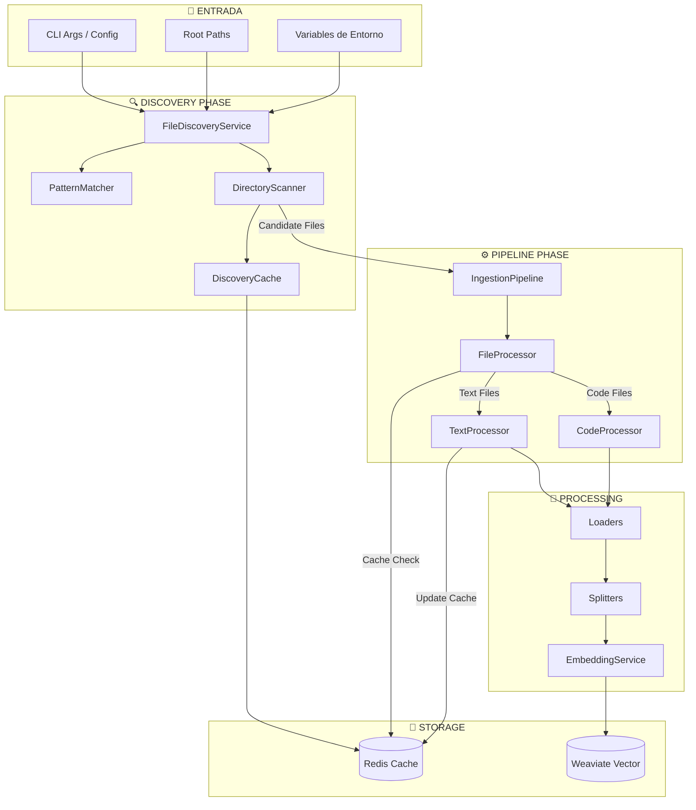
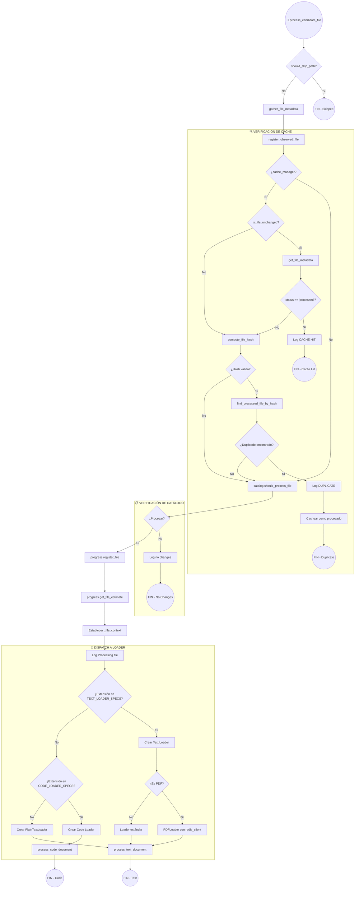
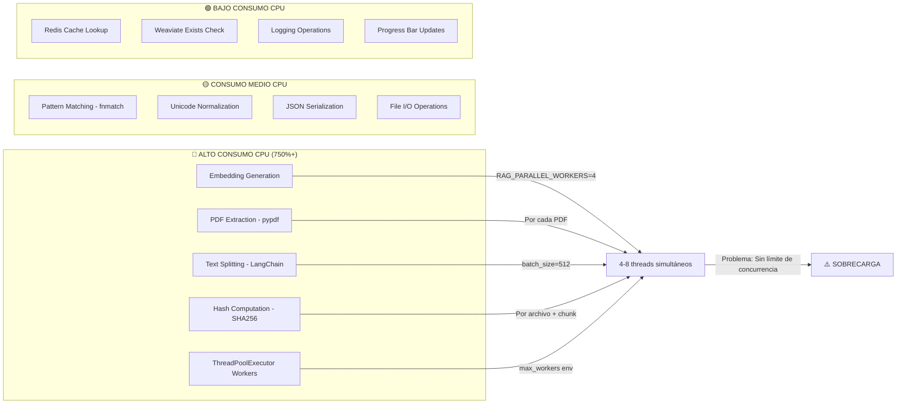
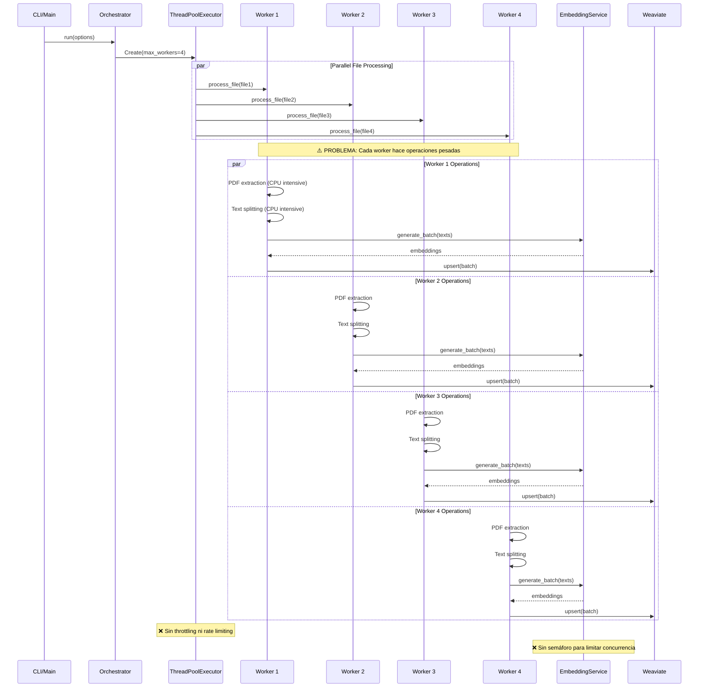
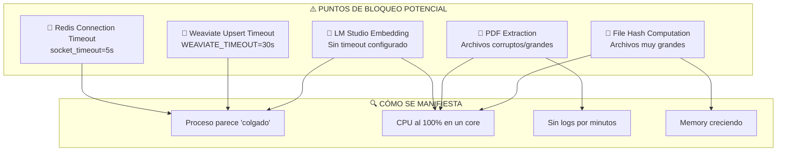
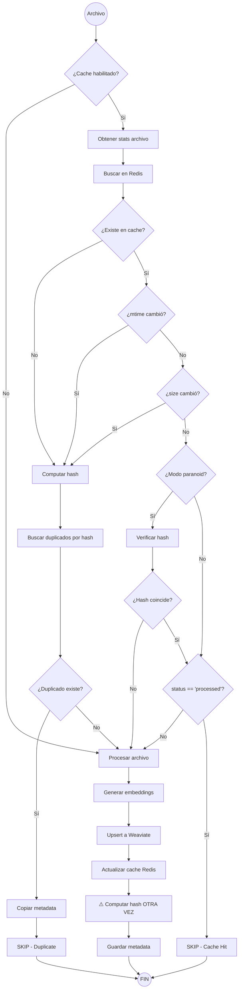

# Análisis Exhaustivo del Sistema de Ingesta RAG-Agentic

## Resumen Ejecutivo

Este documento presenta un análisis detallado del flujo de ingesta end-to-end (E2E) del sistema RAG-Agentic. El análisis identifica puntos críticos de consumo de recursos, posibles cuellos de botella y áreas donde el sistema podría quedarse "atrapado".

---

## 1. Arquitectura General del Sistema de Ingesta

### 1.1 Componentes Principales

```
┌─────────────────────────────────────────────────────────────────────────────┐
│                           SISTEMA DE INGESTA RAG                            │
├─────────────────────────────────────────────────────────────────────────────┤
│                                                                             │
│  ┌─────────────┐    ┌─────────────────┐    ┌──────────────────┐            │
│  │IngestionCLI │───▶│IngestionOrches- │───▶│IngestionPipeline │            │
│  │   (cli.py)  │    │  trator.py      │    │   (pipeline.py)  │            │
│  └─────────────┘    └─────────────────┘    └──────────────────┘            │
│         │                   │                       │                       │
│         ▼                   ▼                       ▼                       │
│  ┌─────────────┐    ┌─────────────────┐    ┌──────────────────┐            │
│  │   Config    │    │FileDiscovery-   │    │  FileProcessor   │            │
│  │ (engine.py) │    │Service.py       │    │(file_processor.py)│           │
│  └─────────────┘    └─────────────────┘    └──────────────────┘            │
│                            │                        │                       │
│                            ▼                        ▼                       │
│                     ┌─────────────────┐    ┌──────────────────┐            │
│                     │DirectoryScanner │    │ Text/Code        │            │
│                     │  (scanner.py)   │    │  Processors      │            │
│                     └─────────────────┘    └──────────────────┘            │
│                                                     │                       │
│  ┌─────────────────────────────────────────────────┼───────────────────┐   │
│  │                    SERVICIOS EXTERNOS           │                   │   │
│  │  ┌──────────┐  ┌──────────┐  ┌─────────┐  ┌────┴─────┐             │   │
│  │  │  Redis   │  │ Weaviate │  │LM Studio│  │Embeddings│             │   │
│  │  │  Cache   │  │  Vector  │  │   LLM   │  │ Service  │             │   │
│  │  └──────────┘  └──────────┘  └─────────┘  └──────────┘             │   │
│  └────────────────────────────────────────────────────────────────────┘   │
│                                                                             │
└─────────────────────────────────────────────────────────────────────────────┘
```

### 1.2 Flujo de Datos de Alto Nivel



---

## 2. Diagrama E2E Detallado del Flujo de Ingesta

### 2.1 Flujo Principal de Ingesta (E2E Completo)

```mermaid
flowchart TB
    START((🚀 INICIO)) --> CLI_INIT[IngestionCLI.__init__]
    CLI_INIT --> PARSE_ARGS[Parsear argumentos CLI]
    PARSE_ARGS --> CONFIG_LOG[Configurar logging]
    CONFIG_LOG --> BUILD_OPTS[build_ingestion_options_from_args]
    
    subgraph ORCHESTRATOR["📋 ORCHESTRATOR - orchestrator.py"]
        BUILD_OPTS --> ORCH_INIT[IngestionOrchestrator.__init__]
        ORCH_INIT --> CACHE_MGR[Inicializar IngestionCacheManager]
        CACHE_MGR --> REDIS_CONN{¿Redis disponible?}
        REDIS_CONN -->|Sí| CACHE_OK[Cache habilitado]
        REDIS_CONN -->|No| CACHE_FAIL[RuntimeError: Redis requerido]
        CACHE_FAIL --> END_ERROR((❌ FIN ERROR))
        
        CACHE_OK --> DISC_SVC[Inicializar FileDiscoveryService]
        DISC_SVC --> ORCH_RUN[orchestrator.run]
        ORCH_RUN --> VALIDATE_PATHS{¿Paths válidos?}
        VALIDATE_PATHS -->|No| PATH_ERROR[FileNotFoundError]
        PATH_ERROR --> END_ERROR
        
        VALIDATE_PATHS -->|Sí| LOG_INTRO[_log_discovery_intro]
        LOG_INTRO --> DISCOVER[_discover_files]
    end
    
    subgraph DISCOVERY["🔍 DISCOVERY - service.py"]
        DISCOVER --> PRECOMPILE[Precompilar patrones glob]
        PRECOMPILE --> HASH_OPTS[Calcular hash de opciones]
        HASH_OPTS --> BUILD_FILTERS[Construir filtros]
        BUILD_FILTERS --> CHECK_ENABLED{¿enabled_paths?}
        
        CHECK_ENABLED -->|Sí| USE_ENABLED[Usar enabled_paths]
        CHECK_ENABLED -->|No| USE_ROOTS[Usar root_paths]
        
        USE_ENABLED --> SCAN_LOOP
        USE_ROOTS --> SCAN_LOOP
        
        SCAN_LOOP[Loop por cada path] --> PATH_EXISTS{¿Existe?}
        PATH_EXISTS -->|No| SKIP_PATH[Log warning, skip]
        SKIP_PATH --> NEXT_PATH{¿Más paths?}
        
        PATH_EXISTS -->|Sí| IS_FILE{¿Es archivo?}
        IS_FILE -->|Sí| CHECK_GLOB{¿Matches glob?}
        CHECK_GLOB -->|Sí| SKIP_PATH
        CHECK_GLOB -->|No| CHECK_EXT{¿Extensión válida?}
        CHECK_EXT -->|Sí| ADD_FILE[Añadir a lista]
        CHECK_EXT -->|No| SKIP_PATH
        
        IS_FILE -->|No| CHECK_DIR_EXCLUDED{¿Dir excluido?}
        CHECK_DIR_EXCLUDED -->|Sí| SKIP_PATH
        CHECK_DIR_EXCLUDED -->|No| CHECK_CACHE{¿Cache válido?}
        CHECK_CACHE -->|Sí| USE_CACHED[Usar archivos cacheados]
        CHECK_CACHE -->|No| SCAN_DIR[scanner.scan_directory]
        
        ADD_FILE --> NEXT_PATH
        USE_CACHED --> NEXT_PATH
        SCAN_DIR --> NEXT_PATH
        NEXT_PATH -->|Sí| SCAN_LOOP
        NEXT_PATH -->|No| SAVE_CACHE[Guardar cache]
    end
    
    subgraph SCANNER["📂 SCANNER - scanner.py"]
        SCAN_DIR --> INIT_STACK[Inicializar stack con path]
        INIT_STACK --> STACK_LOOP{¿Stack vacío?}
        STACK_LOOP -->|Sí| RETURN_COUNT[Retornar dirs escaneados]
        
        STACK_LOOP -->|No| POP_DIR[Pop directorio del stack]
        POP_DIR --> CHECK_VISITED{¿Ya visitado?}
        CHECK_VISITED -->|Sí| INC_SKIP_VISITED[++skipped_visited]
        INC_SKIP_VISITED --> STACK_LOOP
        
        CHECK_VISITED -->|No| CHECK_TREE_EXCLUDED{¿Excluido en árbol?}
        CHECK_TREE_EXCLUDED -->|Sí| INC_SKIP_EXCLUDED[++skipped_excluded]
        INC_SKIP_EXCLUDED --> STACK_LOOP
        
        CHECK_TREE_EXCLUDED -->|No| CHECK_DIR_CACHE{¿Dir en cache?}
        CHECK_DIR_CACHE -->|Sí| USE_DIR_CACHE[Usar cache del dir]
        USE_DIR_CACHE --> MARK_VISITED[Marcar como visitado]
        MARK_VISITED --> STACK_LOOP
        
        CHECK_DIR_CACHE -->|No| SCANDIR[os.scandir]
        SCANDIR --> ENTRY_LOOP{¿Más entries?}
        
        ENTRY_LOOP -->|No| CACHE_DIR[Cachear directorio]
        CACHE_DIR --> MARK_VISITED
        
        ENTRY_LOOP -->|Sí| ENTRY_CHECK{¿Es directorio?}
        ENTRY_CHECK -->|Sí| CHECK_SUBDIR_GLOB{¿Matches glob?}
        CHECK_SUBDIR_GLOB -->|Sí| ENTRY_LOOP
        CHECK_SUBDIR_GLOB -->|No| CHECK_FILTERS{¿Pasa filtros?}
        CHECK_FILTERS -->|Sí| PUSH_STACK[Push al stack]
        CHECK_FILTERS -->|No| ENTRY_LOOP
        PUSH_STACK --> ENTRY_LOOP
        
        ENTRY_CHECK -->|No| CHECK_FILE_GLOB{¿File matches glob?}
        CHECK_FILE_GLOB -->|Sí| ENTRY_LOOP
        CHECK_FILE_GLOB -->|No| CHECK_FILE_FILTERS{¿Pasa filtros?}
        CHECK_FILE_FILTERS -->|Sí| APPEND_FILE[Añadir archivo]
        CHECK_FILE_FILTERS -->|No| ENTRY_LOOP
        APPEND_FILE --> ENTRY_LOOP
    end
    
    SAVE_CACHE --> SORT_FILES[Ordenar por tamaño desc]
    SORT_FILES --> CAP_FILES{¿Límite max_files?}
    CAP_FILES -->|Sí| APPLY_CAP[Aplicar límite]
    CAP_FILES -->|No| CONTINUE_PIPELINE
    APPLY_CAP --> CONTINUE_PIPELINE
    
    CONTINUE_PIPELINE --> DRY_RUN{¿Dry run?}
    DRY_RUN -->|Sí| PRINT_FILES[Imprimir archivos]
    PRINT_FILES --> END_DRY((✅ FIN DRY RUN))
    
    DRY_RUN -->|No| BUILD_PIPELINE[_build_pipeline]
    BUILD_PIPELINE --> INGEST[_ingest]
    
    subgraph PIPELINE_BUILD["🔧 PIPELINE BUILD"]
        BUILD_PIPELINE --> INIT_PROVIDER[ProviderFactory]
        INIT_PROVIDER --> GET_EMBED_SVC[get_embedding_service]
        GET_EMBED_SVC --> GET_VECTOR[get_vector_store]
        GET_VECTOR --> CREATE_PIPELINE[IngestionPipeline.from_options]
    end
    
    INGEST --> PER_FILE{¿per_file_mode?}
    PER_FILE -->|Sí| FILE_BY_FILE[Procesar uno a uno]
    PER_FILE -->|No| BATCH_INGEST[pipeline.ingest_paths]
    
    FILE_BY_FILE --> END_SUCCESS((✅ FIN))
    BATCH_INGEST --> END_SUCCESS
```



### 2.2 Flujo Detallado del Pipeline de Ingesta (pipeline.py)

```mermaid
flowchart TB
    START((📥 ingest_paths)) --> RESET[Reset estados internos]
    RESET --> COLLECT_FILES[Recolectar archivos de paths]
    
    subgraph COLLECTION["📋 RECOLECCIÓN DE ARCHIVOS"]
        COLLECT_FILES --> PATH_LOOP{¿Más paths?}
        PATH_LOOP -->|No| CHECK_TOTAL{¿total_files > 0?}
        CHECK_TOTAL -->|No| FINALIZE_EMPTY[finalize_ingestion_run]
        FINALIZE_EMPTY --> END_EMPTY((FIN - Sin archivos))
        
        PATH_LOOP -->|Sí| ABS_PATH[os.path.abspath]
        ABS_PATH --> EXISTS{¿Existe?}
        EXISTS -->|No| LOG_ERROR[Log error]
        LOG_ERROR --> PATH_LOOP
        
        EXISTS -->|Sí| IS_FILE{¿Es archivo?}
        IS_FILE -->|Sí| RECORD_DIR[record_directory_listing]
        RECORD_DIR --> APPEND_SINGLE[Añadir (path, dir)]
        APPEND_SINGLE --> PATH_LOOP
        
        IS_FILE -->|No| OS_WALK[os.walk]
        OS_WALK --> WALK_LOOP{¿Más dirs?}
        WALK_LOOP -->|No| PATH_LOOP
        WALK_LOOP -->|Sí| SORT_FILES[sorted(files)]
        SORT_FILES --> RECORD_DIR_WALK[record_directory_listing]
        RECORD_DIR_WALK --> FILE_LOOP{¿Más files?}
        FILE_LOOP -->|No| WALK_LOOP
        FILE_LOOP -->|Sí| APPEND_BATCH[Añadir (full_path, root)]
        APPEND_BATCH --> FILE_LOOP
    end
    
    CHECK_TOTAL -->|Sí| CREATE_PROGRESS[Crear ProgressBar]
    CREATE_PROGRESS --> INIT_COUNTERS[completed=0, failed=0]
    
    subgraph PARALLEL["🔄 PROCESAMIENTO PARALELO"]
        INIT_COUNTERS --> CREATE_EXECUTOR[ThreadPoolExecutor]
        CREATE_EXECUTOR --> SUBMIT_ALL[Enviar todos los archivos]
        
        SUBMIT_ALL --> FUTURE_LOOP{¿Más futures?}
        FUTURE_LOOP -->|No| CHECK_FAILURES{¿failed > 0?}
        CHECK_FAILURES -->|Sí| LOG_WARN[Log warnings]
        CHECK_FAILURES -->|No| FINISH_BAR[bar.finish]
        LOG_WARN --> FINISH_BAR
        
        FUTURE_LOOP -->|Sí| WAIT_COMPLETE[as_completed(future)]
        WAIT_COMPLETE --> GET_RESULT[future.result]
        GET_RESULT --> INC_COMPLETED[++completed]
        INC_COMPLETED --> CHECK_SUCCESS{¿success?}
        CHECK_SUCCESS -->|No| INC_FAILED[++failed]
        CHECK_SUCCESS -->|Sí| UPDATE_BAR
        INC_FAILED --> UPDATE_BAR[bar.update]
        UPDATE_BAR --> FUTURE_LOOP
    end
    
    FINISH_BAR --> FINALIZE[finalize_ingestion_run]
    FINALIZE --> END((✅ FIN))
    
    subgraph WORKER["⚡ WORKER - _process_single_file_safe"]
        SUBMIT_ALL -.->|Thread Worker| WORKER_START[Recibir archivo]
        WORKER_START --> TRY_PROCESS[process_candidate_file]
        TRY_PROCESS --> CATCH{¿Excepción?}
        CATCH -->|Sí| RETURN_ERROR[Return (path, False, error)]
        CATCH -->|No| RETURN_SUCCESS[Return (path, True, None)]
    end
```

### 2.3 Flujo Detallado del Procesamiento de Archivos (file_processor.py)



### 2.4 Flujo Detallado del Procesamiento de Texto (text_processor.py)

```mermaid
flowchart TB
    START((📝 process_text_document)) --> RESOLVE_SOURCE[resolve_loader_source]
    RESOLVE_SOURCE --> RESOLVE_CONTEXT[_resolve_file_context]
    
    subgraph LOAD_STAGE["📥 STAGE: LOAD"]
        RESOLVE_CONTEXT --> START_LOAD_REPORT[IngestionStageReporter 'load']
        START_LOAD_REPORT --> CALL_LOADER[call_loader - loader.load]
        CALL_LOADER --> END_LOAD_REPORT[Fin Reporter]
    end
    
    END_LOAD_REPORT --> CHECK_DOCS{¿documents vacío?}
    CHECK_DOCS -->|Sí| EMPTY_PROGRESS[progress.add_total 0]
    EMPTY_PROGRESS --> END_EMPTY((FIN - Empty))
    
    CHECK_DOCS -->|No| LOG_LOADED[Log loaded docs count]
    LOG_LOADED --> CHECK_MAX{docs > RAG_MAX_DOCS_PER_FILE?}
    CHECK_MAX -->|Sí| LOG_SKIP_MAX[Log warning skip]
    LOG_SKIP_MAX --> END_MAX((FIN - Max Exceeded))
    
    subgraph SPLIT_STAGE["✂️ STAGE: SPLIT"]
        CHECK_MAX -->|No| START_SPLIT_REPORT[IngestionStageReporter 'split']
        START_SPLIT_REPORT --> SPLIT_WITH_PROGRESS[_split_documents_with_progress]
        
        subgraph SPLIT_LOOP["Loop de Splitting"]
            SPLIT_WITH_PROGRESS --> BATCH_LOOP{¿Más batches?}
            BATCH_LOOP -->|Sí| GET_BATCH[Obtener batch]
            GET_BATCH --> SPLIT_BATCH[split_documents batch]
            SPLIT_BATCH --> EXTEND_CHUNKS[chunks.extend]
            EXTEND_CHUNKS --> CHECK_LOG_TIME{¿Loguear progreso?}
            CHECK_LOG_TIME -->|Sí| LOG_SPLIT_PROGRESS[Log con ETA]
            CHECK_LOG_TIME -->|No| BATCH_LOOP
            LOG_SPLIT_PROGRESS --> BATCH_LOOP
        end
        
        BATCH_LOOP -->|No| END_SPLIT_REPORT[Fin Reporter]
    end
    
    END_SPLIT_REPORT --> CHECK_CHUNKS{¿chunks vacío?}
    CHECK_CHUNKS -->|Sí| END_NO_CHUNKS((FIN - No Chunks))
    
    subgraph PREPARE_STAGE["🔧 STAGE: PREPARE SEGMENTS"]
        CHECK_CHUNKS -->|No| START_PREP_REPORT[IngestionStageReporter 'prepare_segments']
        START_PREP_REPORT --> PREPARE_SEGMENTS[prepare_embedding_segments]
        PREPARE_SEGMENTS --> END_PREP_REPORT[Fin Reporter]
    end
    
    END_PREP_REPORT --> CHECK_PREPARED{¿prepared_chunks vacío?}
    CHECK_PREPARED -->|Sí| END_NO_PREP((FIN - No Prepared))
    
    subgraph EMBED_STAGE["🧠 STAGE: EMBED + UPSERT"]
        CHECK_PREPARED -->|No| START_EMBED_REPORT[IngestionStageReporter 'embed+upsert']
        START_EMBED_REPORT --> INIT_BATCH[Inicializar batch_records]
        
        INIT_BATCH --> CHUNK_LOOP{¿Más chunks?}
        CHUNK_LOOP -->|No| FINAL_FLUSH{¿batch no vacío?}
        FINAL_FLUSH -->|Sí| FLUSH_BATCH
        FINAL_FLUSH -->|No| END_EMBED_REPORT[Fin Reporter]
        
        CHUNK_LOOP -->|Sí| SANITIZE[sanitize_text]
        SANITIZE --> TRUNCATE[truncate_to_token_limit]
        TRUNCATE --> GEN_HASH[generate_hash_presanitized]
        
        GEN_HASH --> CHECK_DUP_HASH{hash_exists?}
        CHECK_DUP_HASH -->|Sí| INC_SKIPPED[++skipped]
        INC_SKIPPED --> CHUNK_LOOP
        
        CHECK_DUP_HASH -->|No| CHECK_VECTOR_EXISTS{vector_store_contains?}
        CHECK_VECTOR_EXISTS -->|Sí| ADD_HASH[add_hash]
        ADD_HASH --> INC_SKIPPED
        
        CHECK_VECTOR_EXISTS -->|No| BUILD_RECORD[Construir record]
        BUILD_RECORD --> APPEND_BATCH[batch_records.append]
        
        APPEND_BATCH --> SHOULD_FLUSH{batch >= batch_size OR último?}
        SHOULD_FLUSH -->|No| CHUNK_LOOP
        
        subgraph FLUSH_BATCH["💾 FLUSH BATCH"]
            SHOULD_FLUSH -->|Sí| CHECK_BATCH_MODE{supports_batch?}
            CHECK_BATCH_MODE -->|Sí| GEN_BATCH[generate_batch]
            CHECK_BATCH_MODE -->|No| GEN_SEQUENTIAL[generate secuencial]
            
            GEN_BATCH --> UPSERT_LOOP{¿Más records?}
            GEN_SEQUENTIAL --> UPSERT_LOOP
            
            UPSERT_LOOP -->|No| CLEAR_BATCH[batch_records.clear]
            CLEAR_BATCH --> CHUNK_LOOP
            
            UPSERT_LOOP -->|Sí| BUILD_META[Construir metadata]
            BUILD_META --> PRUNE_META[prune_metadata]
            PRUNE_META --> UPSERT[vector_store.upsert]
            UPSERT --> ADD_HASH_DONE[add_hash]
            ADD_HASH_DONE --> INC_PROCESSED[++processed]
            INC_PROCESSED --> CHECK_LOG{¿Loguear progreso?}
            CHECK_LOG -->|No| UPSERT_LOOP
            CHECK_LOG -->|Sí| LOG_EMBED_PROGRESS[Log con barra]
            LOG_EMBED_PROGRESS --> UPSERT_LOOP
        end
    end
    
    END_EMBED_REPORT --> FINALIZE_FILE[finalize_file_ingestion]
    FINALIZE_FILE --> UPDATE_CACHE[_update_file_cache]
    UPDATE_CACHE --> END_SUCCESS((✅ FIN))
```



---

## 3. Diagrama de Distribución de Recursos

### 3.1 Puntos de Alto Consumo de CPU



### 3.2 Análisis de Concurrencia



---

## 4. Puntos Críticos Identificados

### 4.1 Problema 1: Procesamiento Paralelo Sin Control

**Ubicación:** `pipeline.py` líneas 205-242

```python
# Código problemático
with ThreadPoolExecutor(max_workers=self._max_workers) as executor:
    future_to_file = {
        executor.submit(
            self._process_single_file_safe,  # Operación pesada
            full_path,
            idx + 1,
            total_files,
            directory_path,
        ): (full_path, idx + 1)
        for idx, (full_path, directory_path) in enumerate(all_files_to_process)
    }
```

**Problema:** Envía TODOS los archivos al ThreadPoolExecutor inmediatamente, sin control de backpressure.

### 4.2 Problema 2: Embedding Service Sin Rate Limiting

**Ubicación:** `text_processor.py` líneas 320-345

```python
# Sin límite de concurrencia para embeddings
if supports_batch:
    embeddings = pipeline.embedding_service.generate_batch(texts)
else:
    embeddings = []
    for r in batch_records:
        emb = pipeline.embedding_service.generate(r["text"])
        embeddings.append(emb)
```

**Problema:** Múltiples threads pueden llamar al embedding service simultáneamente.

### 4.3 Problema 3: Hash Computation Redundante

**Ubicación:** `file_processor.py` líneas 158-162

```python
content_hash = cache_manager.compute_file_hash(full_path)  # PRIMER hash
if content_hash:
    duplicate_meta = cache_manager.find_processed_file_by_hash(content_hash)
    # ...

# Más adelante en _update_file_cache
content_hash = cache_manager.compute_file_hash(full_path)  # SEGUNDO hash (redundante)
```

**Problema:** El hash del archivo se computa DOS veces para el mismo archivo.

### 4.4 Problema 4: Scanner Stack Puede Crecer Indefinidamente

**Ubicación:** `scanner.py` líneas 60-170

```python
stack = [(current_path, "")]
while stack:
    dirpath, rel_dirpath = stack.pop()
    # ... procesa directorio ...
    stack.extend(reversed(dirs_to_add))  # Añade más directorios
```

**Problema:** Para estructuras de directorios muy profundas o con muchos subdirectorios, el stack puede crecer sin límite.

---

## 5. Diagrama de Posibles Puntos de Bloqueo



---

## 6. Flujo de Decisiones del Cache



---

## 7. Resumen de Variables de Entorno Críticas

| Variable | Default | Ubicación | Impacto |
|----------|---------|-----------|---------|
| `RAG_PARALLEL_WORKERS` | 4 | pipeline.py:95 | Número de threads simultáneos |
| `RAG_EMBED_BATCH_SIZE` | 32 | text_processor.py:268 | Tamaño de batch para embeddings |
| `RAG_SPLIT_BATCH_SIZE` | 256 | text_processor.py:117 | Tamaño de batch para splitting |
| `RAG_MAX_DOCS_PER_FILE` | 200,000 | text_processor.py:205 | Límite de documentos por archivo |
| `RAG_EMBED_LOG_EVERY_N_CHUNKS` | 10 | text_processor.py:269 | Frecuencia de logs |
| `WEAVIATE_TIMEOUT` | 30 | engine.py:61 | Timeout de Weaviate |
| `REDIS_HOST/PORT` | redis:6379 | engine.py:82-83 | Conexión Redis |

---

## 8. Conclusiones y Próximos Pasos

### Problemas Principales Identificados:

1. **Sobrecarga de CPU (750%)**: Causada por múltiples workers ejecutando operaciones CPU-intensive simultáneamente sin throttling.

2. **Hash Redundante**: El hash de archivos se computa dos veces innecesariamente.

3. **Sin Backpressure**: El ThreadPoolExecutor recibe todos los archivos de golpe sin control de flujo.

4. **Sin Rate Limiting para Embeddings**: Las llamadas al servicio de embeddings no tienen límite de concurrencia.

5. **Posibles Deadlocks**: Los locks (`_hash_cache_lock`, `_catalog_lock`, `_progress_lock`) podrían causar contención.

### Archivos Clave para Revisión:
- `src/rag/ingestion/pipeline/pipeline.py` - Control de paralelismo
- `src/rag/ingestion/pipeline/text_processor.py` - Procesamiento de embeddings
- `src/rag/ingestion/pipeline/file_processor.py` - Hash redundante
- `src/storage/cache/ingestion/file_cache.py` - Lógica de cache

---

*Generado el: 2024*
*Proyecto: RAG-Agentic*
