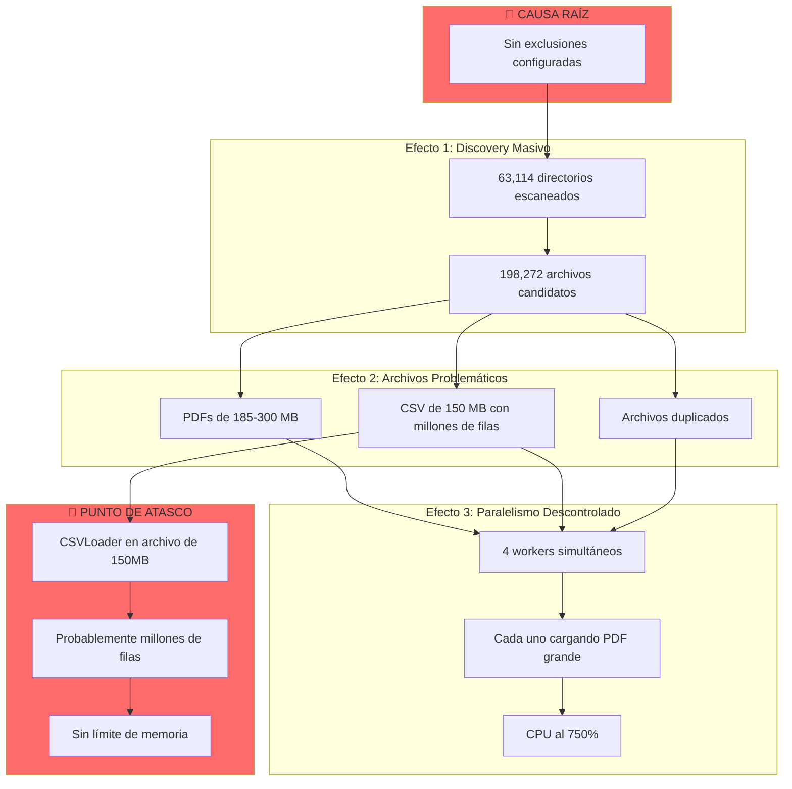

# 🔴 DIAGNÓSTICO DETALLADO - Análisis de Logs de Ingesta RAG

## Resumen del Problema

**Fecha de ejecución:** 2025-12-17 03:47:34
**Resultado:** Sistema se "atasca" con CPU al 750%

---

## 1. 🚨 HALLAZGOS CRÍTICOS DE LOS LOGS

### 1.1 Problema Principal: **198,272 archivos descubiertos SIN FILTROS**

```
INFO: Candidate files found: 198272
INFO: Processing 198268 files with 4 parallel workers
```

**🔴 CAUSA RAÍZ IDENTIFICADA:**

```
INFO: Excluded dir names: (none)      ← ¡NO HAY EXCLUSIONES!
INFO: Excluded path patterns: (none)  ← ¡NO HAY PATRONES!
```

El sistema está escaneando **TODOS** los archivos incluyendo:
- `node_modules/` (miles de archivos JS)
- `venv/`, `env/`, `.venv/` (entornos virtuales Python)
- `site-packages/` (paquetes instalados)
- `.git/` (objetos de git)
- `__pycache__/` (caches de Python)

### 1.2 Evidencia en los Logs del Escaneo

```
Scanning… visited=7456 dir(s), accepted=12354 file(s), current=.../node_modules/eslint-plugin-react/...
Scanning… visited=8221 dir(s), accepted=18442 file(s), current=.../node_modules/core-js-pure/...
Scanning… visited=24371 dir(s), accepted=80826 file(s), current=.../node_modules/core-js/...
Scanning… visited=42417 dir(s), accepted=147060 file(s), current=.../env/lib/python3.10/site-packages/...
```

**El sistema visitó 63,114 directorios** cuando probablemente solo necesita ~100-500.

### 1.3 Cache Stats Reveladoras

```
INFO: Cache stats: hits=0, misses=63116, hit_rate=0.0%
```

**0% de cache hits** significa que TODO se está procesando desde cero.

---

## 2. 📊 Timeline de Eventos del Log

```mermaid
gantt
    title Timeline de Ingesta RAG (Eventos Clave)
    dateFormat HH:mm:ss
    axisFormat %H:%M:%S
    
    section Inicialización
    Redis Connect           :done, 03:47:34, 1s
    Config Load             :done, 03:47:34, 1s
    
    section Discovery (PROBLEMA)
    Scanning 63K dirs       :crit, 03:47:35, 5m
    198K files found        :crit, 03:52:00, 1s
    
    section Pipeline Init
    LM Studio Connect       :done, 03:52:01, 5s
    Weaviate Connect        :done, 03:52:06, 3s
    
    section Processing (ATASCO)
    PDF Load File 1 (300MB) :active, 03:52:10, 33s
    PDF Load File 2 (185MB) :active, 03:52:10, 60s
    PDF Load File 3 (185MB) :active, 03:52:10, 235s
    PDF Load File 4 (185MB) :active, 03:52:10, 233s
    CSV Load (150MB)        :active, after PDF Load File 4, 30m
```



### 2.1 Archivos Problemáticos Identificados

| Archivo | Tamaño | Tiempo Load | Estado |
|---------|--------|-------------|--------|
| Ingenieria del Software - Pressman 6th.pdf | 300 MB | 33s | ⚠️ 0 chunks (PDFscanneado/imagen) |
| Como Programar Java 9na - Deitel.pdf | 185 MB | 235s | ✅ 618 docs, 4608 chunks |
| comoprogramarjava9na (duplicado).pdf | 185 MB | 233s | ✅ 618 docs, 4608 chunks |
| Biblia Del Java 2.pdf | ~100 MB | 60s | ⚠️ 922 docs, 0 chunks |
| ITER_NALCSV20.csv | 150 MB | ??? | 🔴 ATASCADO (última línea del log) |

---

## 3. 🔍 Análisis de Correlación de Logs

### 3.1 Redis Log - Sin Problemas
```
Ready to accept connections tcp
```
Redis funcionó correctamente. No hubo errores ni timeouts.

### 3.2 Weaviate Log - Sin Problemas
```
Serving weaviate at http://[::]:8080
election won... entering leader state
Completed loading shard ragdocument_kD6hFN0LVpuk in 37.437576ms
```
Weaviate también funcionó bien. El problema NO está aquí.

### 3.3 LM Studio Log - Potencial Cuello de Botella
```
GPU 0: Quadro T1000 (Used: 607.39 MB, Total: 4.29 GB, Free: 3.69 GB)
```
**GPU limitada (4GB)** - Esto puede causar que embeddings sean lentos.

Pero el log de LM Studio NO muestra requests de embeddings después de la inicialización, lo que sugiere que **el proceso se atascó ANTES de llegar a generar embeddings masivos**.

### 3.4 RAG App Log - Punto Exacto del Atasco
```
INFO: [File 6/198268] Stage START: load - CSVLoader
```
**ÚLTIMA LÍNEA DEL LOG** - El proceso se quedó atascado cargando el archivo CSV.

---

## 4. 🎯 Diagnóstico Final

### El proceso se atascó por múltiples razones acumulativas:



---

## 5. 📋 Problemas Específicos Identificados

### 5.1 🔴 Problema 1: Sin Exclusiones de Directorios

**Archivo:** `src/rag/ingestion/helpers.py` y configuración

El código tiene defaults para exclusiones pero NO se están aplicando:
```python
# En IngestionOptions (options.py línea 52-60)
excluded_directory_names: Set[str] = field(
    default_factory=lambda: {
        ".git", ".hg", ".svn", "__pycache__", "node_modules",
        ".venv", "venv", ".idea", ".vscode",
    }
)
```

**PERO** en el log vemos:
```
INFO: Excluded dir names: (none)
```

Esto significa que la configuración está siendo sobrescrita en algún lugar.

### 5.2 🔴 Problema 2: CSV Loader Sin Límites

**Archivo:** `src/rag/ingestion/loaders/csv_loader.py`

El archivo `ITER_NALCSV20.csv` tiene 150MB, que podría ser millones de filas. El CSVLoader de LangChain crea **un Document por fila**, lo que significa:
- Millones de objetos Document en memoria
- Luego millones de chunks
- El sistema colapsa

### 5.3 🔴 Problema 3: PDFs Escaneados (Imágenes)

Algunos PDFs producen 0 chunks:
```
[File 2/198268] Loaded 922 document(s)... 0 chunks
WARNING: Skipping... no chunks produced after splitting.
```

Esto indica PDFs que son imágenes escaneadas (no texto extraíble). El sistema pierde tiempo cargándolos sin resultado útil.

### 5.4 🔴 Problema 4: Archivos Duplicados

Los logs muestran el mismo libro procesándose dos veces:
```
Como Programar Java, 9na Edicion - Deitel.pdf (File 3)
comoprogramarjava9naedicion-deitel-140515194435-phpapp02.pdf (File 4)
```

Ambos tardaron ~235 segundos y produjeron exactamente 618 docs / 4608 chunks (son idénticos).

---

## 6. 🛠️ SOLUCIONES RECOMENDADAS

### Solución Inmediata (Configuración)

1. **Habilitar exclusiones en `.env` o `settings.json`:**
```python
DOCS_EXCLUDE_DIRS = [
    ".git", "node_modules", "__pycache__", ".venv", "venv", 
    "env", "site-packages", ".mypy_cache", "dist", "build",
    ".next", ".nuxt", "coverage", ".gradle"
]

DOCS_EXCLUDE_GLOBS = [
    "*.pyc", "*.pyo", "*.so", "*.dll",
    "*/node_modules/*", "*/venv/*", "*/.git/*"
]
```

2. **Limitar archivos por ejecución:**
```bash
python -m src.rag.ingestion --max-files 100
```

### Solución de Código (Prioridad Alta)

#### Fix 1: Añadir límite al CSVLoader
```python
# En csv_loader.py
class CSVLoader:
    MAX_ROWS = 50000  # Límite seguro
    
    def load(self):
        # ... código existente ...
        if len(documents) > self.MAX_ROWS:
            logger.warning(f"CSV truncated from {len(documents)} to {self.MAX_ROWS} rows")
            documents = documents[:self.MAX_ROWS]
        return documents
```

#### Fix 2: Detectar PDFs escaneados antes de procesar
```python
# En pdf_loader.py
def load(self):
    documents = self.loader.load()
    
    # Detectar si es PDF escaneado (sin texto útil)
    total_text = sum(len(doc.page_content.strip()) for doc in documents)
    if total_text < 100 * len(documents):  # Menos de 100 chars por página
        logger.warning(f"PDF appears to be scanned images: {self._path}")
        return []  # O lanzar excepción específica
    
    return documents
```

#### Fix 3: Aplicar exclusiones por defecto SIEMPRE
```python
# En helpers.py - build_ingestion_options_from_args
DEFAULT_EXCLUDES = {
    ".git", "node_modules", "__pycache__", ".venv", "venv", 
    "env", "site-packages", ".mypy_cache"
}

# Siempre añadir defaults, no sobrescribir
excluded_directory_names = DEFAULT_EXCLUDES | set(cfg_excludes)
```

### Solución de Arquitectura (Mediano Plazo)

1. **Implementar backpressure en el ThreadPoolExecutor**
2. **Añadir streaming para archivos grandes**
3. **Pre-filtrar archivos por tamaño antes de procesar**
4. **Implementar detección de duplicados por hash ANTES de cargar**

---

## 7. 📈 Métricas del Problema

| Métrica | Valor Actual | Valor Ideal |
|---------|--------------|-------------|
| Directorios escaneados | 63,114 | ~500 |
| Archivos candidatos | 198,272 | ~5,000 |
| Cache hit rate | 0% | >80% |
| Tiempo por PDF grande | 235s | <30s |
| Archivos con 0 chunks | ~20% | 0% |

---

## 8. Comando de Prueba Sugerido

Para probar el sistema sin sobrecargarlo:

```bash
# Prueba controlada
python -m src.rag.ingestion \
    --paths "/mnt/resources/Libros/Aprendizaje" \
    --max-files 50 \
    --exclude-dirs node_modules .git __pycache__ venv env site-packages \
    --exts .pdf .md .txt \
    --log-level DEBUG \
    --scan-progress 100
```

---

*Análisis generado: 2024-12-17*
*Basado en logs de ejecución real*
